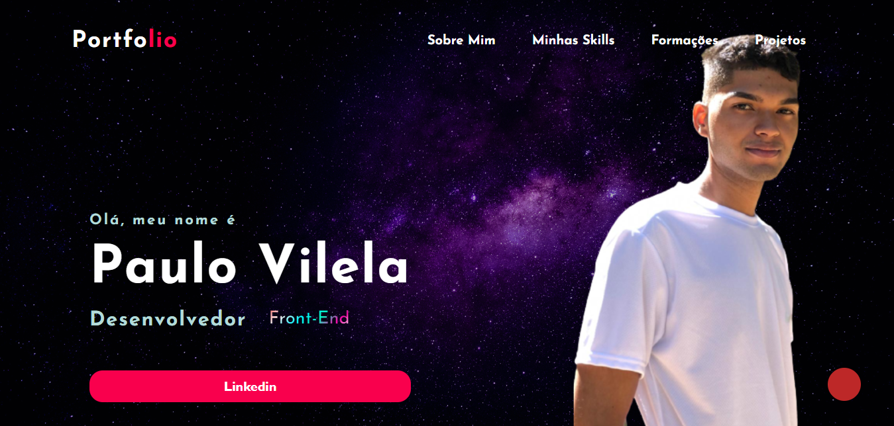
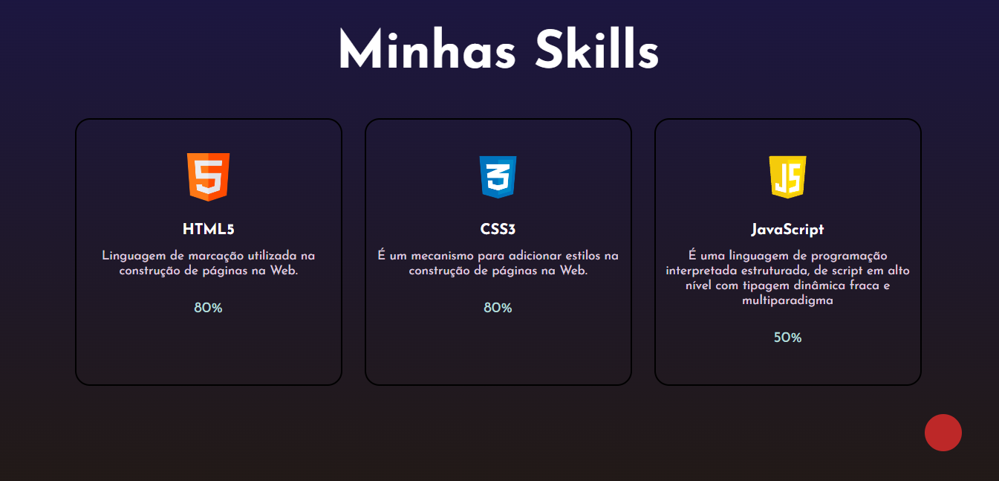
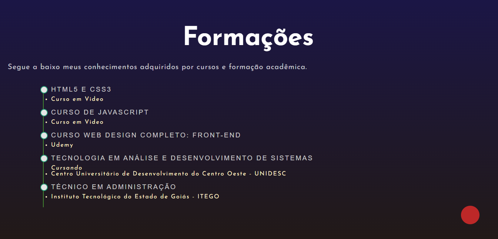

<h4>Projeto desenvolvido com HTML5 e CSS#</h4>

Portfólio criado com objetivo de mostrar um poucosobre mim, minhas formações, cursos e habilidades.

 
Link para vizualizar projeto: <a href="#">Acessar portfólio</a>
 
 
<h5>Página principal - Home</h5>

 
<h5>Página Sobre-Mim</h5>

 
<h5>Página Minha Skills</h5>

 
<h5>Página Formações</h5>

 
<h5>Página projetos realizados</h5>
